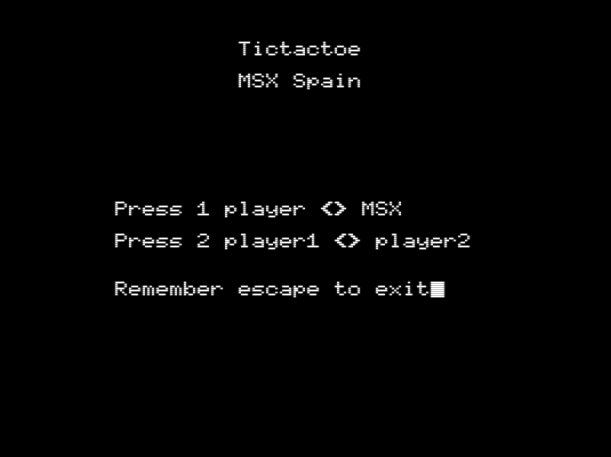
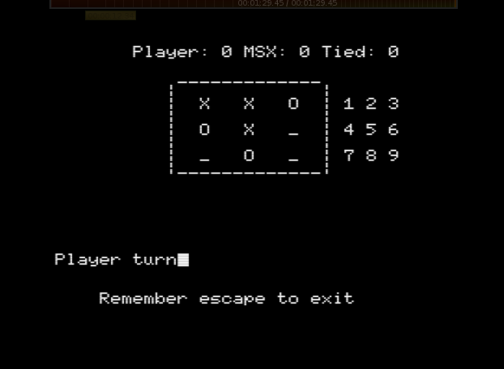
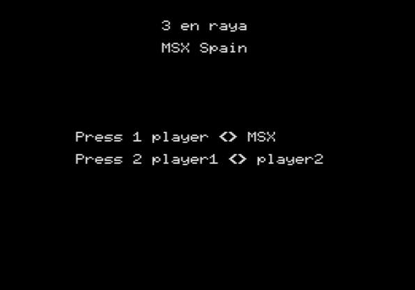
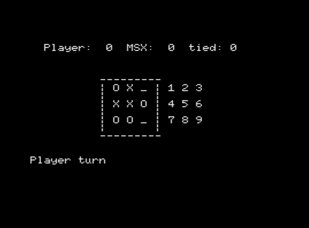
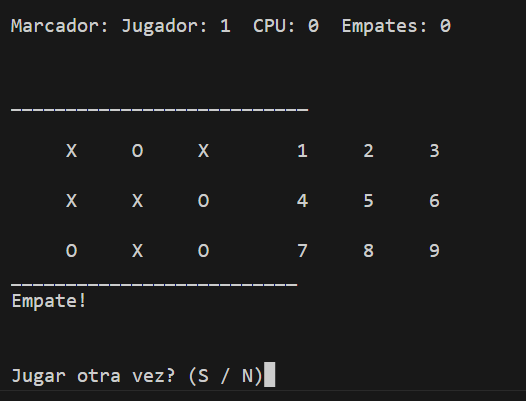

# DESCRIPCION

Juego de 3 en raya para la plataforma retro MSX (microordenador de los años 80), diviertete.

# MSX1

## C

Juega online

https://kikemadrigal.github.io/?disk=tictactoe-C.dsk

## BASIC
Juega online

https://kikemadrigal.github.io/?disk=tictactoe-BASIC.dsk

# DESKTOP (PYTHON)

Escribe python main.py en la terminal o CMD

