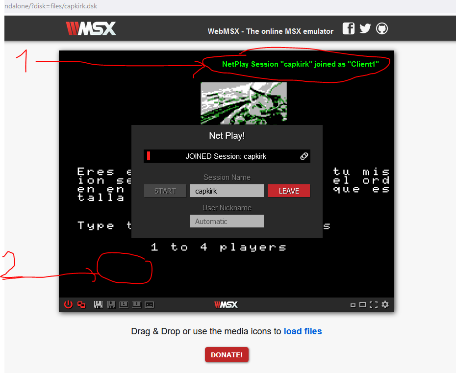
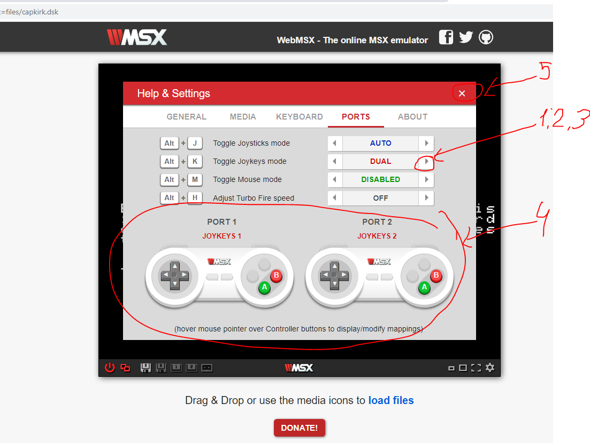

# Crear el servidor o jugador 1 

Pincha el en enlace: [Crear partida](https://kikemadrigal.github.io/kikemadrigal-MSX-basic-c-scroll-horizontal-MSX2-deep-space/?disk=MSX2-C.dsk) 

Pincha en el botón de pwer (1) y en Ne play (2)

Ahora pone un nombre (1) y pincha en START (2) 

Cuando aparezca arriba a la derecha "NETPlay session "capkirk" started (1) es que la partida en el servidor (o jugador 1) se ha creado, pinchamos en cualquier otro lugar para que se cierre lo de escribir el nombre:

# Crear el 1 cliente o jugador 2

Pincha el en enlace: [Unirse a partida](https://kikemadrigal.github.io/kikemadrigal-MSX-basic-c-scroll-horizontal-MSX2-deep-space/?disk=MSX2-C.dsk)

Puncha en el botón de pwer (1) y en Ne play (2)

Escribe en Sessio Name "capkirk" (1) y picha en "JOIN" (2)

Cuando aparezca el mensaje de arriba a la derecha (1) te habrás conectado a la partida (habrás creado el jugador 2), picha en cualquier otro lugar para cerrar la ventana donde se escribe el nombre:

## Selecciona el 2 joystick para mover el jugador 2

Pincha en el engranage (1), después en Help & Settings (2)

Pincha en la flecha de la derecha en la sección de Toggle Joykeys mode (1):

Pincha varias veces en la flecha de la derecha (1,2,3 )hasta que aparezca el dibujo de los 2 joystick (4) y ponga "DUAL", pincha en la cruz para cerrar la ventana (5):

# Comenzar el juego

 En el servidor o juegador 1, pulsas la tecla 2:

