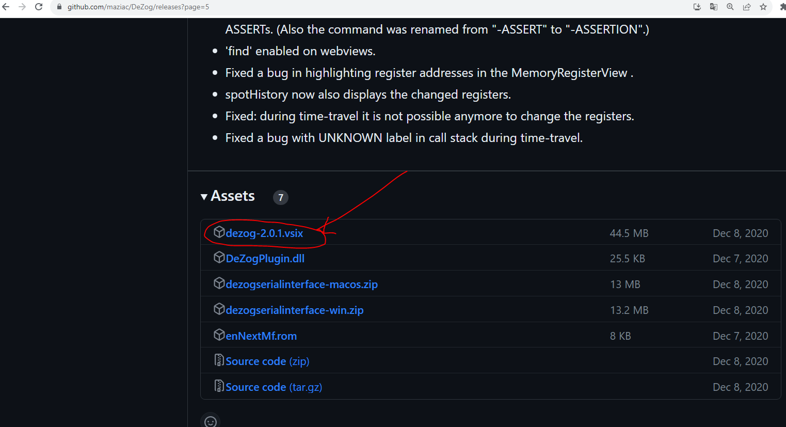
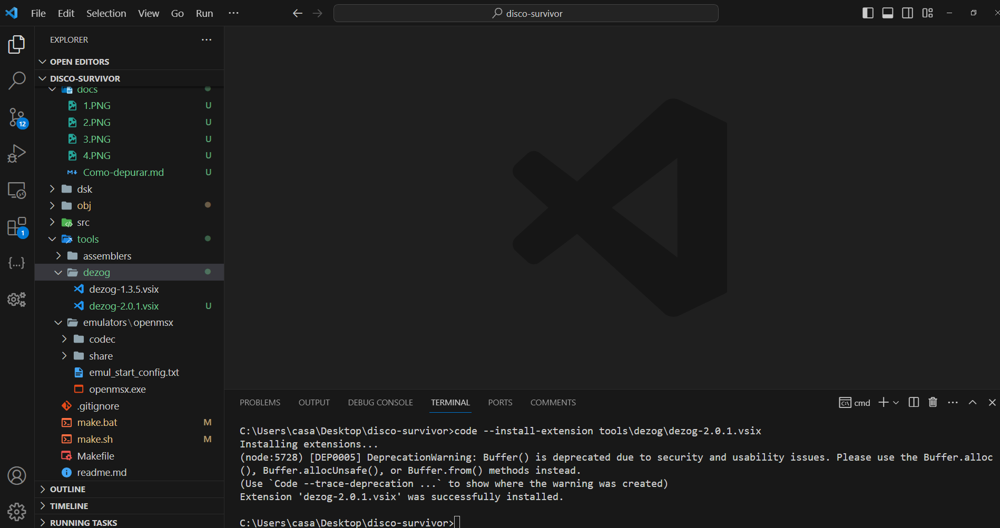
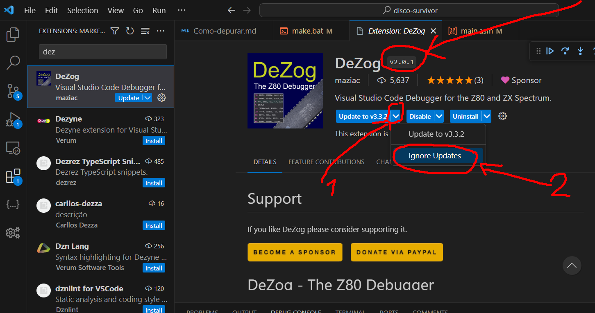
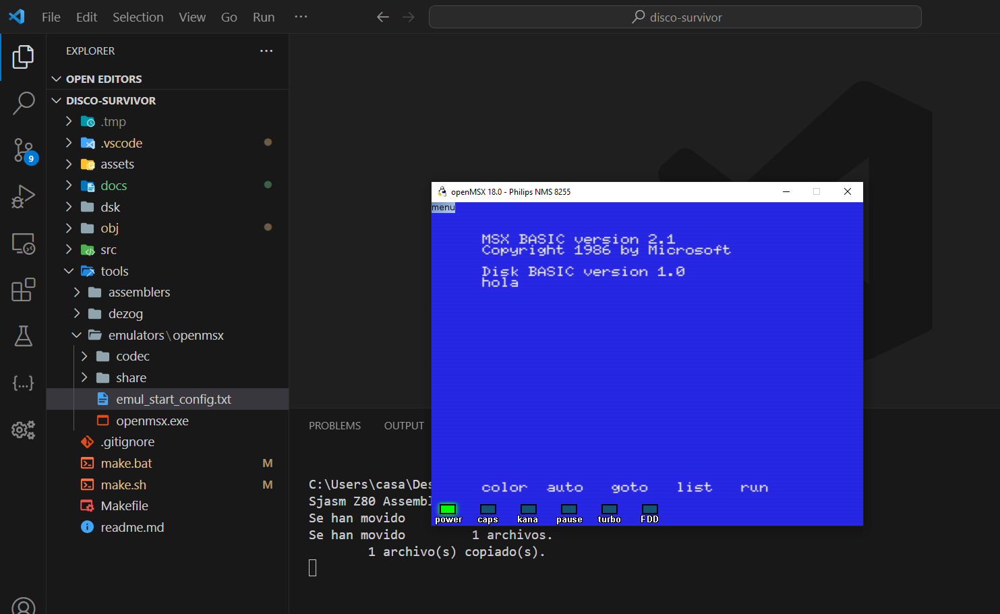
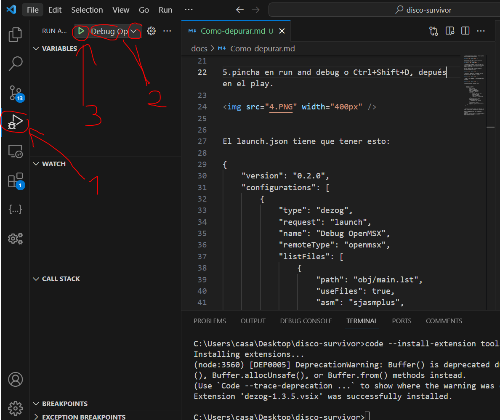
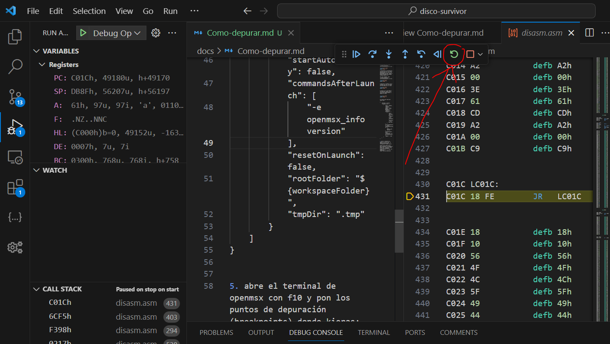
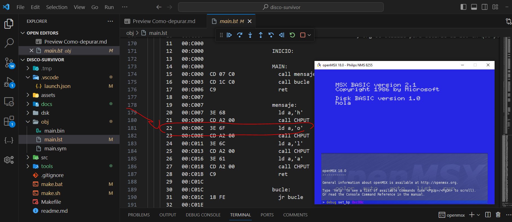
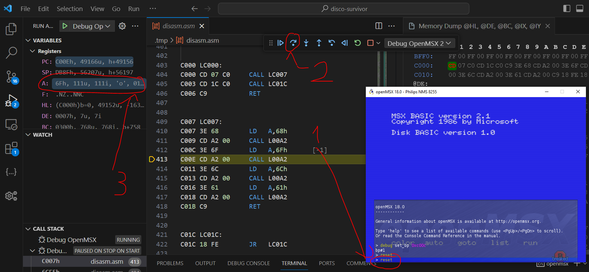

1.Instalamos Dezog con: code --install-extension tools\dezog\dezog-2.0.1.vsix o lo descargamos de aquí: https://github.com/maziac/DeZog/releases?page=5







Importante, en la versión del complemento dezog debe aparecer 2.0.1, ignora las actualizaciones, si aparece otra te dirá que openmsx no existe:



2.Instalamos el prorgrama de sourceror que está en tools\dezog\dezog-1.3.5.vsix o lo descargamos de aquí: https://github.com/S0urceror/DeZog/releases/tag/v1.3.5

Con este comando: code --install-extension tools\dezog\dezog-1.3.5.vsix


3.Ejecutra el openmsx con un programa que esté corriendo, escribe make.bat en el cmd:




4.Pincha en run and debug o Ctrl+Shift+D, depués en el selecciona Debug openmsx y después en play:





El launch.json tiene que tener esto:

```
{
    "version": "0.2.0",
    "configurations": [
        {
            "type": "dezog",
            "request": "launch",
            "name": "Debug OpenMSX",
            "remoteType": "openmsx",
            "listFiles": [
                {
                    "path": "obj/main.lst",
                    "useFiles": true,
                    "asm": "sjasmplus",
                    "mainFile": "src/main.asm"
                }
            ],
            "startAutomatically": false,
            "commandsAfterLaunch": [
                "-e openmsx_info version"
            ],
            "resetOnLaunch": false,
            "rootFolder": "${workspaceFolder}",
            "tmpDir": ".tmp"
        }
    ]
}
```

Si se queda esperando pincha en restart:

 


5.Pon el archivo obj/main.lst a la vista y abre el terminal de openmsx con f10 y pon los puntos de depuración (breakpoints) donde kieras:


debug set_bp 0xdirección: para establecer un breakpoint

debug cont: continuar hasta el proximo breakpoint

debug list_bp: ver todos los breakpoint

debug remove_bp bp#numero

En mi caso pondré debug set_bp 0xc00c ya que quiero poner un punto de interrupción en la "o":



Escribe en el terminal reset, pincha en step uver y mira el valor de los registros:




