# Disco survivor

George debe llegar a la salida de la discoteca para ello deberá de intentar no chocarse con nadie, cuidado con el coronavirus!

# Play online

https://msx-spain.github.io/Disco-survivor/?disk=main.dsk&M=MSX2E

  

# Develop

Escribe en un cmd o terminal:

## Windows:

"make.bat" para compilar el proyecto MSX basic utilizando dir as disk

"make.bat dos" para compilar el proyecto MSX DOS utilizando dir as disk

"make.bat rom32" para compilar el proyecto ROM 32Kb utilizando un cartucho

## Unix:

"chmod +x make.sh" para dar permisos de ejecución

"./make.sh" para compilar

# Test sjasmplus + dezod debugger

Pincha aquí para ver como depurar en ensamblador:

<a href="docs/Como-depurar.md">Como depurar</a>

## Audios

[Menu](docs/music-menu.mp3)

<video controls="" autoplay="" name="media" width="200px" height="50px"><source src="docs/music-menu.mp3" type="audio/mpeg"  ></video>

[Ingame](docs/music-ingame.mp3)

<video controls="" autoplay="" name="media" width="200px" height="50px"><source src="docs/music-ingame.mp3" type="audio/mpeg" ></video>

[Final](docs/music-final.mp3)

<video controls="" autoplay="" name="media" width="200px" height="50px"><source src="docs/music-final.mp3" type="audio/mpeg"></video>

## Spriteset

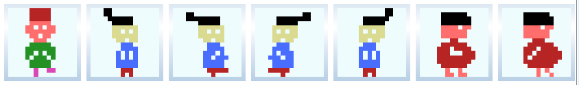

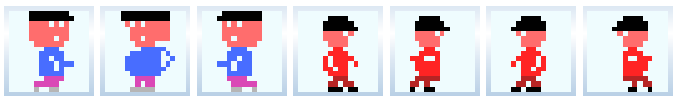

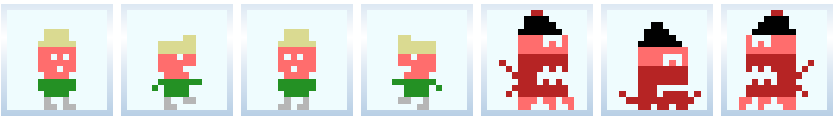

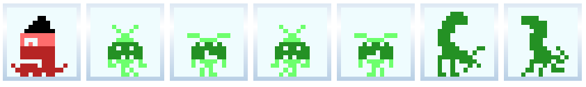

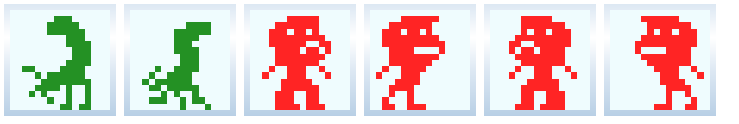

## Tileset

Del 0 al 32 los de decoración.

del hacia delante los sólidos

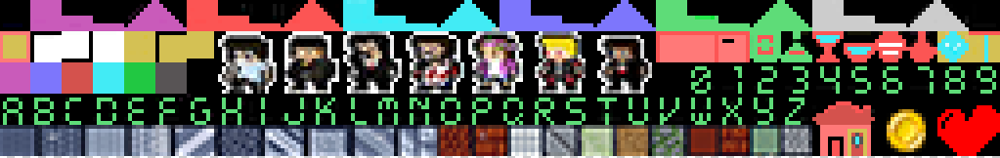

## Screens /levels

Menu

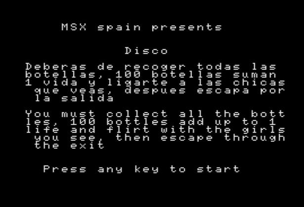

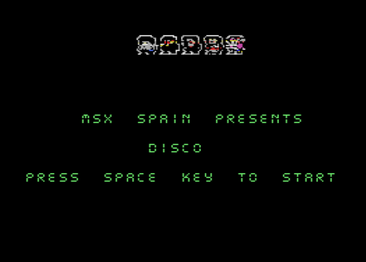

Level 1

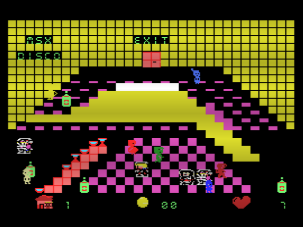

Level 2

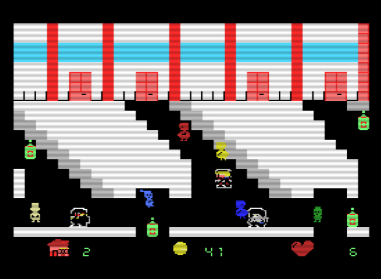

Level 3

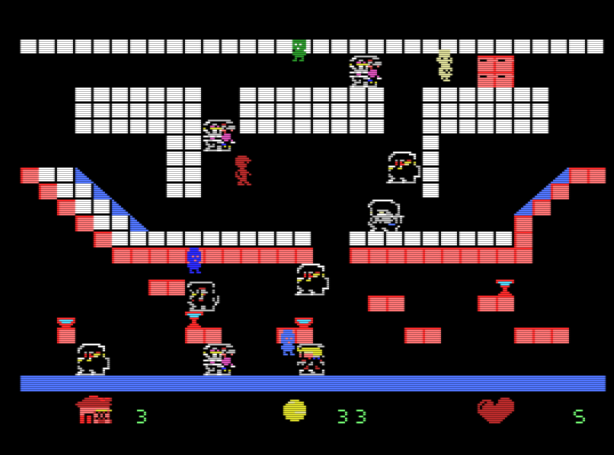

Level 4

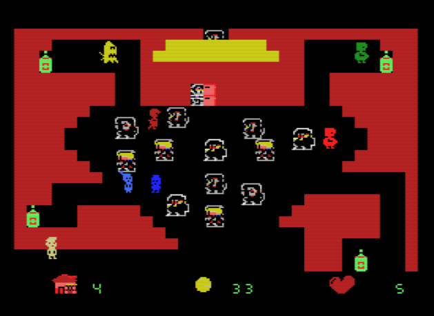

Level 5

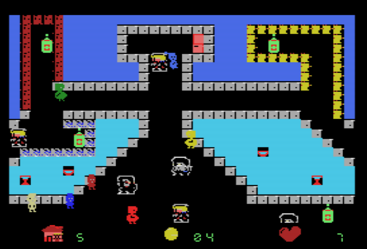

Level 6

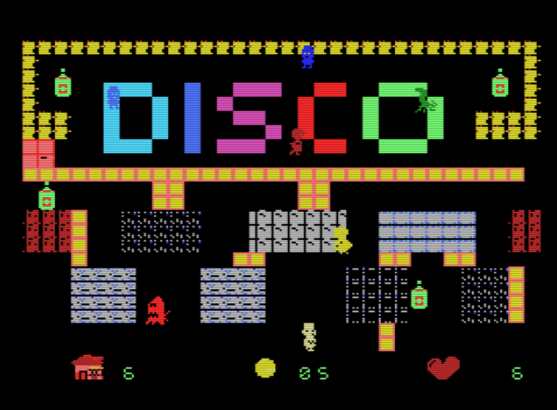

Level 7

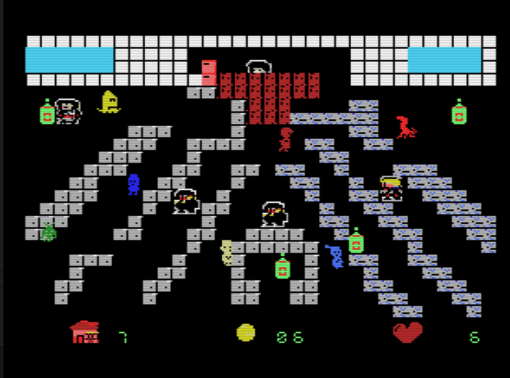

Level 8

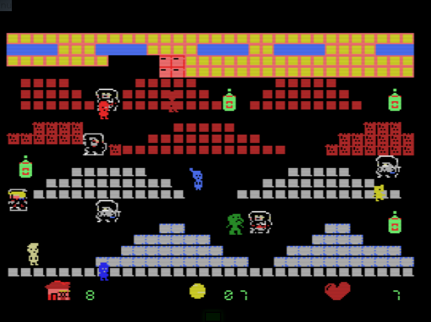

Level 9

Level 10

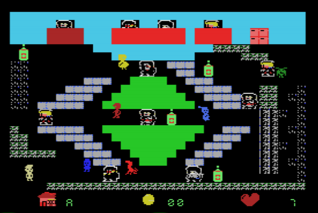

Level 11

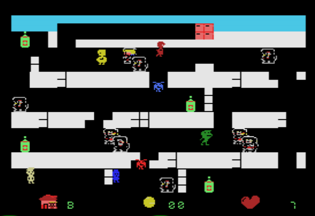

Level 12

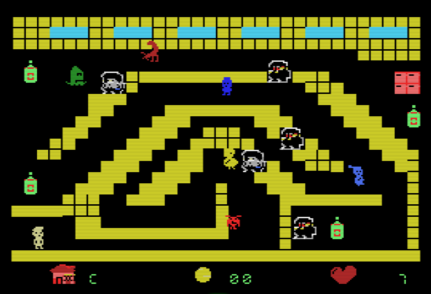

Final

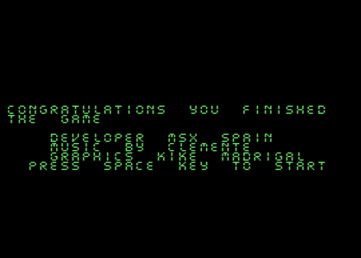