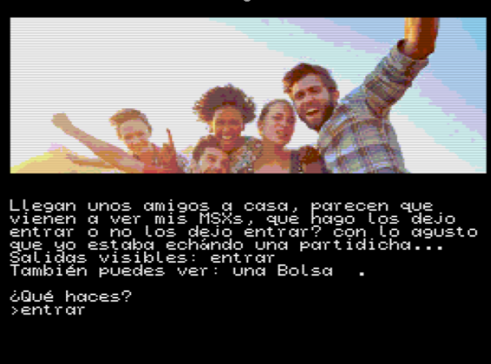
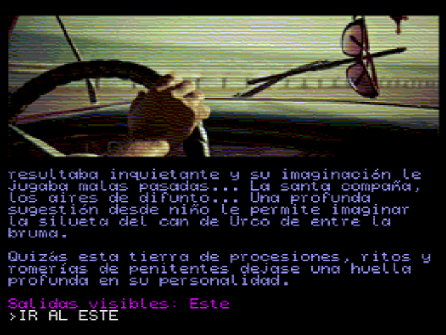
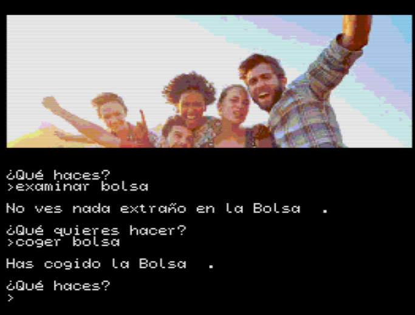

# Friends

Aventura conversacional para probar el famoso DAAD

### Play online

https://kikemadrigal.github.io/MSX2-DAAD-friends/?disk=friends.dsk

## Build

Escriba en el command pront de windows:

make.bat para compilar de la forma antigua

y make_new.bat para compilar con la forma moderna

# Sobre DAAD

-Las aventuras conversacionales son juegos de texto basados en la exploración de localidades y la manipulación de objetos al alcance inmediato del protagonista.  

-Las acciones se comunican al ordenador mediante frases sencillas del tipo "acción-objeto" o “verbo-nombre”.   

-Ten en cuneta que DAAD funciona con pantallas o localidades y con objetos que aparecen en esas localidades.
En las pantallas se muestran unos mensajes que te dicen que acciones puedes tomar.

-Cuando te pone “Salidas visibles: “ entrar, salir, norte, sur, este, oeste, subir o bajar, eso quiere decir que tienes que escribir en “¿Que haces?” ->ir al norte.

-En el siguiente ejemplo como solo me da la posibilidad de entrar escribo entrar:
 

 

-En algunas ocasiones te puedes confundir ya que puedes pensar que es otra dirección, en el siguiente ejemplo esta mal poner entrar, hay que escribir ir”ir al oeste” ya que es lo que te pone en salidas visibles:

 
-Cuando te pone “También puedes ver: “ una bolsa, eso significa que puedes escribir coger, soltar, quitar, vaciar, poner, meter, sacar, hablar, decir, examinar, mirar, etc, la lista completa de palabras que puede interpretar DAAD se encuentra en la sección /VOC del famoso archivo.sce
 

-El movimiento se efectúa mediante puntos cardinales "IR NORTE", "SUR", "OESTE" o sus abreviaturas: N, S, E, O. Ocasionalmente órdenes como "SUBIR", o "ENTRAR" también funcionarán.   

-Hay acciones comunes con los objetos son "COGER objeto", "DEJAR objeto", "EXAMINAR objeto" (o su abreviatura "EX"). "INVENTARIO" (o "I") lista los objetos llevados.

-MIRAR" o "M" redescribe la localidad, “SALIDAS” describe las salidas y “FIN O FINALIZAR” termina el juego.       

-DAAD es del mismo creador que paws de Tim gilberts, en un principio PAW(el padre de DAAD era un programa para spectrum) https://caad.club/descargas_software/paws/ .

DAAD es un motor ya creado en ensamblador y compilado a .com que te permite con unos programas en pc poder crear de una manera sencilla aventuras gráficas, para construir el juego tienes 2 opciones:

1.Antigua: utilizando DC (DAAD Compiler), mirar proceso de compilación archivo make.bat

    1.1	Creamos el archivo GAME.SCE a mano (estudiando las secciones) o con trizbort y triz2daad

    1.2	Creamos el archivo DAAD.DDB con DOSBox+DC.EXE

    1.3	Creamos las imágenes adaptadas a MSX2DAAD.COM con imgwizard.

    1.4	Creamos el archivo.dsk con el MSX2DAAD.COM el DAAD.DDB y las imágenes con diskmanager.

2.Moderna, utilizando DRC (DAAD Reborn Compiler)

	2.1 Creamos el archivo.DSF con trizbort+ triz2daad (con el marámetro -dr) o a mano y estudiamos las secciones, para ayudarnos con el archivo dsf podemos utilizar el programa EDAAD.

	2.2 con DRF.exe y con el archivo.DSF creamos el archivo.JSON

	2.3 Con php y el archivo JSON creamos el DDB

	2.4 Transformamos las imágenes screen5, screen8, etc creadas con imgeviwer y convertidas a archivo.im0, archivo.im1, etc con imgwizard, las metemos en un disco con disk-manager.

-La idea es que creas una base de datos o fichero intermedio.ddb y unos ficheros con la imagen.im0, imagen.im1, etc(estos archivos son imágenes sc2..sc8 convertidas con el programa imgwizard), estos ficheros serán leídos por el msx2DAAD.com, todos meterlos en un dsk que será abierto con openMSX como dirAsDisk. 😊 ánimo.

-Para poder desarrollar un juego en DAAD tienes que aprender las distintas instrucciones que tiene y las secciones en las que se divide el código. Una vez que lo hayas aprendido, puedes empezar escribiendo en la sección /PRO 5 que con un verbo y con cualquier palabra si está el objeto “teléfono” en esa localidad que hagas una llamada, por ejemplo.