# LEO must live :dog:

LEO debe vivir es una idea de Pedro Otalora para el grupo [MSX spain], (http://msx.tipolisto.es/quien-somos), música de Clemente Tiñena. La idea es participar en el concurso 40 aniversario MSX Basic de la web [MSXBlog](https://www.msxblog.es/).

Hemos sido los ganadores!!!

https://www.msxblog.es/resultado-final-del-concurso-40-aniversario-msx-basic/

LEO must live we hope it will be a game for the LEO must live is an idea by Pedro Otalora (Music by Clemente Tiñena) for the group [MSX spain](http://msx.tipolisto.es/quien-somos) for [MSXBlog Konamito contest 40 aniversay MSX Basic (https://www.msxblog.es/).

We are the winners of the msxblog.es contest

:hearts:

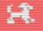

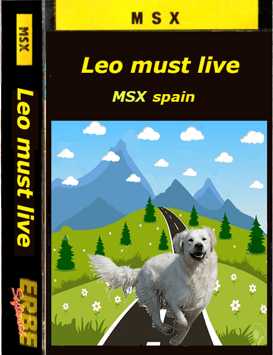

## Play online :video_game:

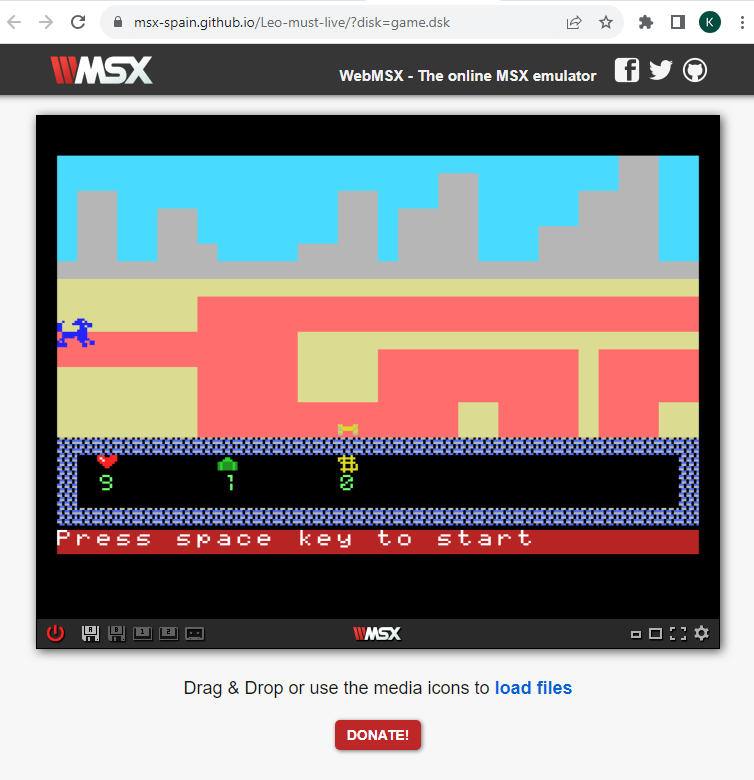

### Production release

https://msx-spain.github.io/Leo-must-live/?disk=game.dsk&M=MSX2E

### Development debug
https://msx-spain.github.io/Leo-must-live/?disk=game-dev.dsk&M=MSX2E

# Instructions :dog2:

Conduce a Leo y no te salgas del camino, ¡cuidado! Leo va muy rápido y puedes confundirte de camino, recoge todos los huesos que encuentres para sumar puntos e intenta llegar hasta el final, esquiva a los enemigos que quieren cazarte, salta en las pantallas 2,4 y 6.

Drive Leo and don't get off the road, be careful! Leo goes very fast and you can get confused on the way, collect all the bones you find to score points and try to reach the end, avoid the enemies that want to hunt you, jump on screens 2, 4 and 6.

# Development

## Spriteset

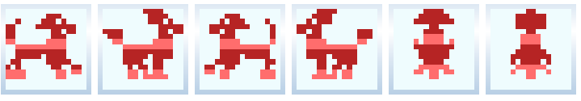

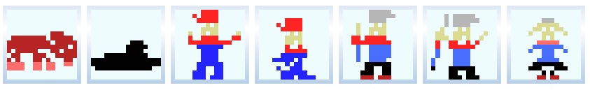

## Tileset

Del 0 al 4 los que aparecen en el marcador.

del 5 al 9 los cogiles.

del 10 al 63 ambientación.

del 64 al 96 los que mueres.

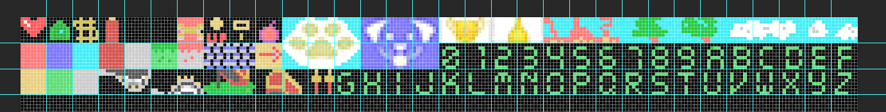

## Screens /levels

Menu

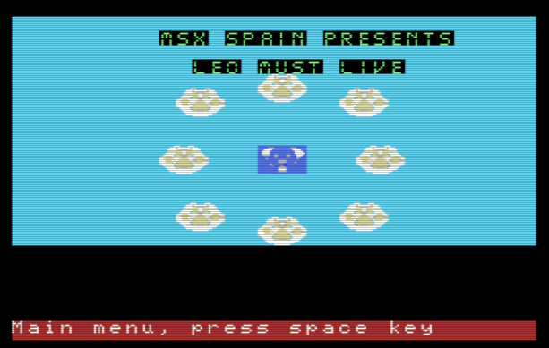

Level 1

Esquiva a los enemigos-dodge the enemies.

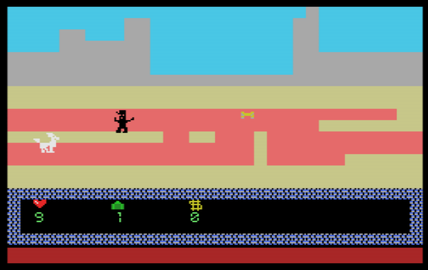

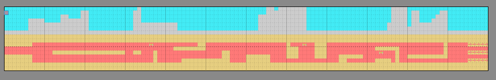

Level 2

Salta en los caminos cortados-Jump on the cut roads.

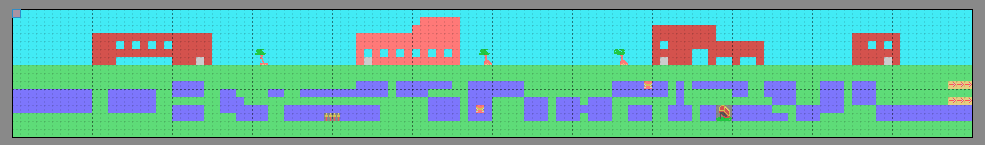

Level 3

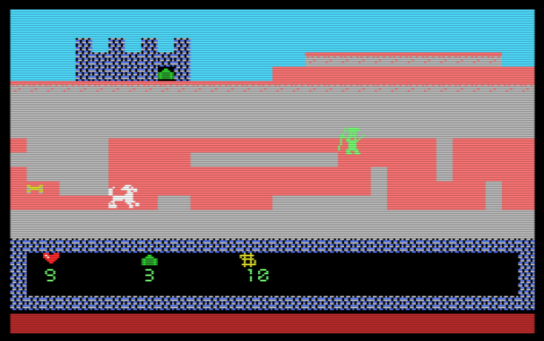

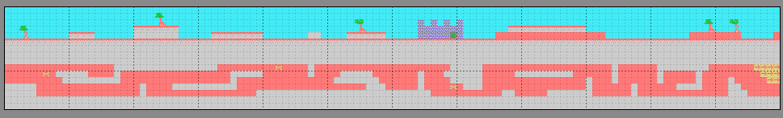

Level 4

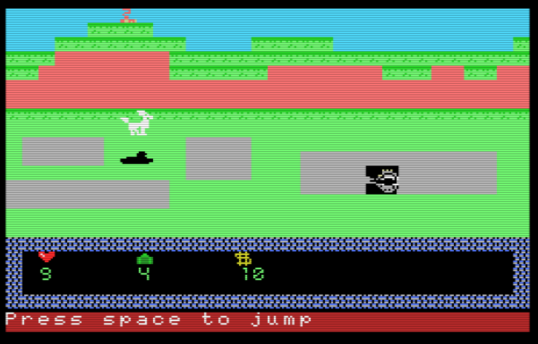

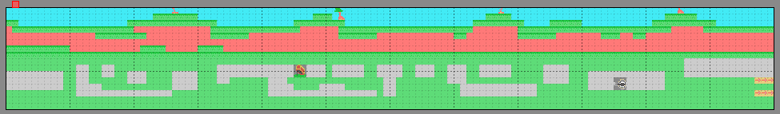

Level 5

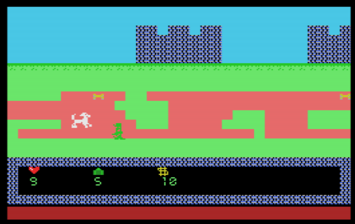

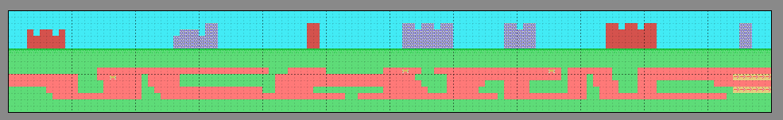

Level 6

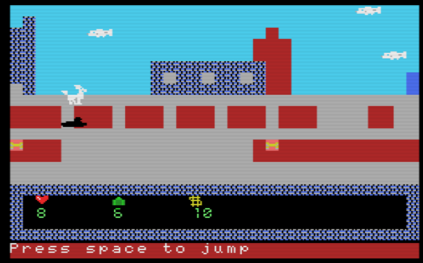

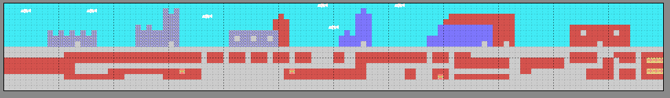

Final

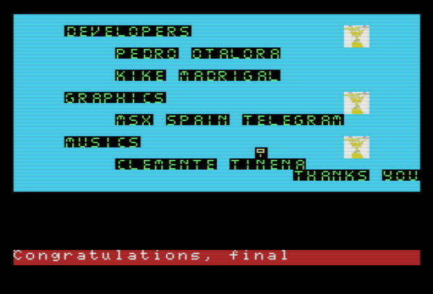

## Build

Escriba en en el terminal o ventana de comandos o terminal de unix:

Type in in the terminal or command window or unix terminal:

*make*: para correr su emulador favorito utilizando la función DirAsDisk.

*make all*: para correr su emulador y generar los archivos .dsk, .rom, .cas y .tsx

*make dsk*: para correr su emulador, utilizando un archivo dsk generado

*make rom*: para correr su emulador, utilizando un archivo rom generado

*make cas*: para correr su emulador, utilizando un archivo cas generado

*make tsx*: para correr su emulador, utilizando un archivo tsx generado

otra opción es crear una tarea en vscode y ejecutarla

*make clean*

*make clean all*: borrar los archivos temporales y los archivos obj, dsk, rom, cas y tsx

## Structure / scafolding

src: están los archivos fuente bas y asm

assets: irán los archivos o los binarios generados por los programas como MSXTools, photoshop, etc:

    *.xspr son archivos creados con spritedevtools que serán convertidos a .bas o .bin

    *.tmx y *.csv archivos creados con tilemap que serán convertidos a .bin

    *.psd, creados con photoshop

    *.jpg y *.png capturas, fotos descargadas o retocadas

    *.sc2  Screens generados por MSX1-graphic-converter,*.sc5,etc generados con msxviewer, nMSXTIles/MSXTilesdevtool, 

    *.pt3,*.wiz,*.mwm, *.mbm audios creados con vortes tracker, arckos tracker, wiz tracker, moundblaster, etc 

    * compiladores xbasic.bin, nbasic.bin turbobasic, nextorbasic

dsk: carpeta que es utilizada para trabajar como DiskAsDir

tools: van todos los programas que necesitemos

docs: irán los archivos de la documentación, también el index.html con el webMSX y el dsk de prueba

