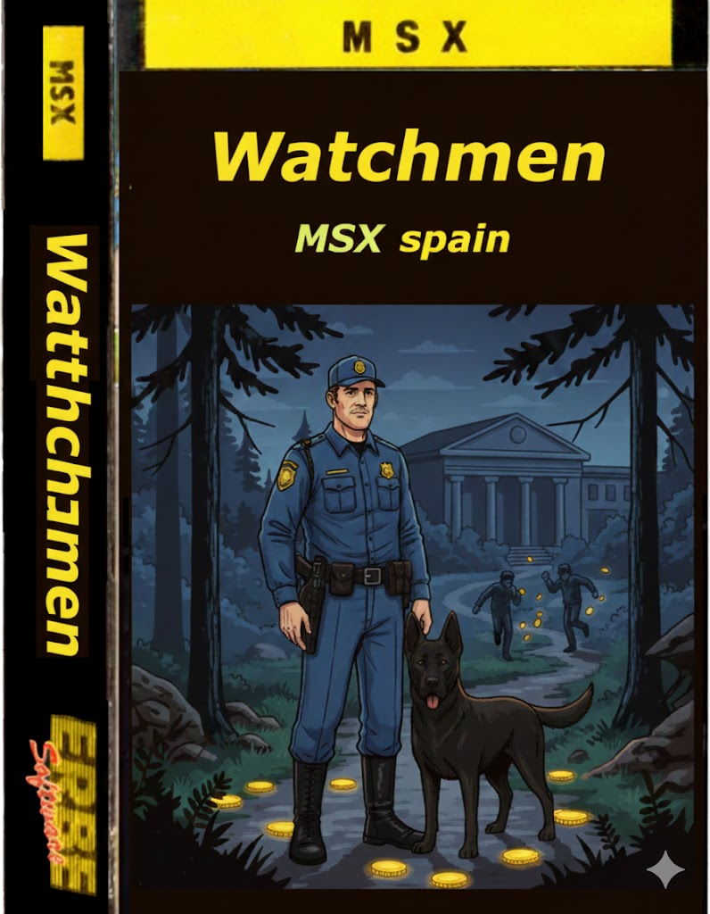
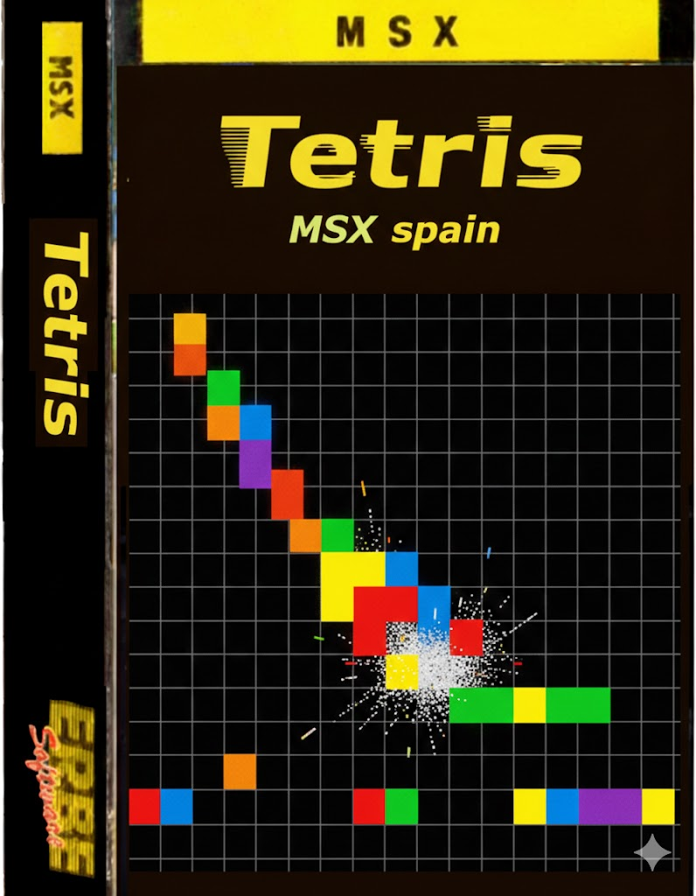
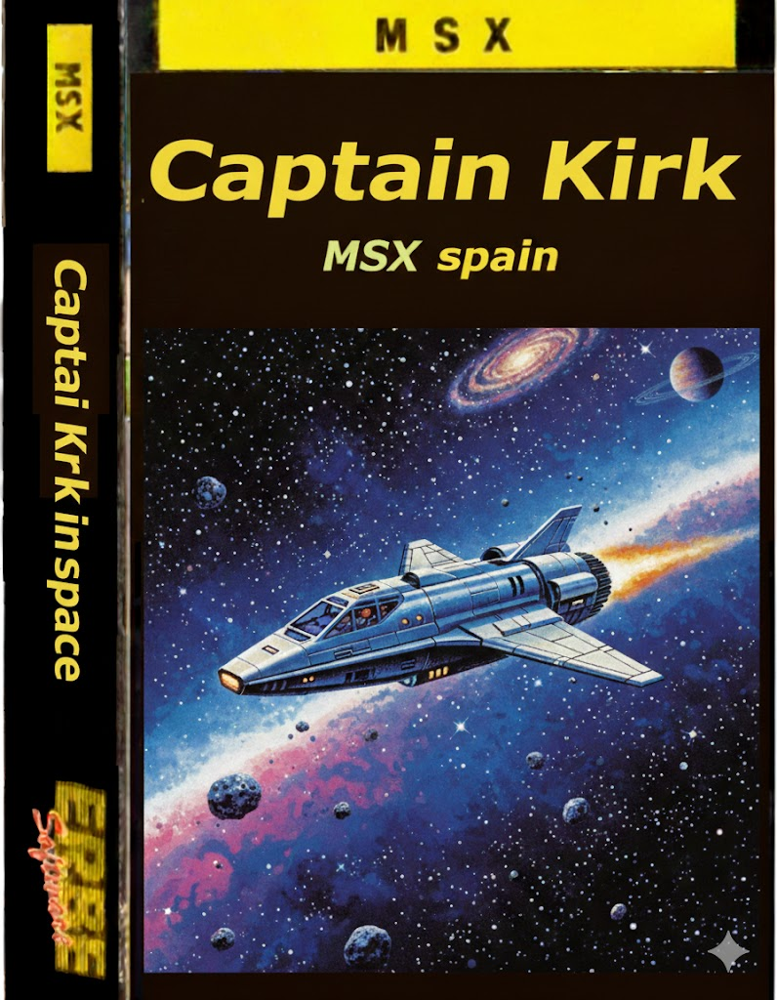
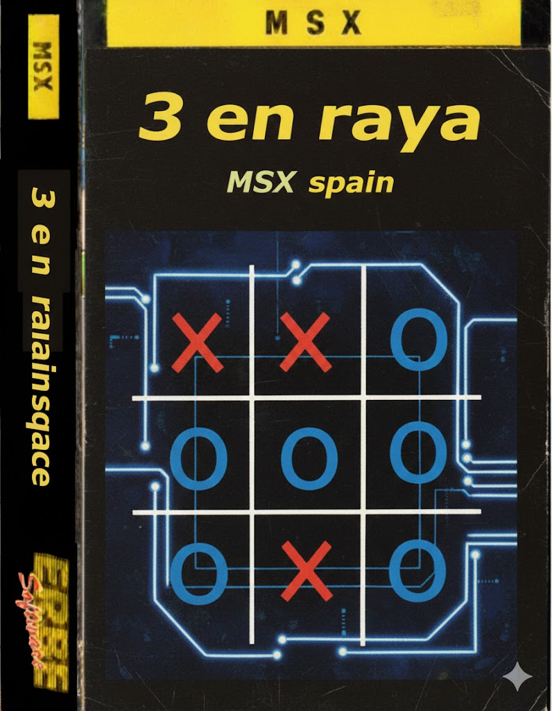

# juegos

1. <a href="https://github.com/kikemadrigal/MSX-projects/tree/main/Hunter-MSX1-asm-MPAGD" target="_blanck">
    Hunter

    
    </a>

    Plataforma: MSX1

    Language: asm-MPAGD

    <a href="https://kikemadrigal.github.io/MSX-projects/?disk=hunter.dsk&M=MSX2E" taeget="_blanck">Play Hunter´s trail</a>
    

2. <a href="https://github.com/kikemadrigal/MSX-projects/tree/main/Leo-must-live-MSX1-basic" taeget="_blanck">
    Leo must live
    
    </a>

    Plataforma: MSX1

    Language: basic

    <a href="https://kikemadrigal.github.io/MSX-projects/?disk=leo.dsk&M=MSX2E" taeget="_blanck">Play Leo must live</a>

    

3. <a href="https://github.com/kikemadrigal/MSX-projects/tree/main/Mansion-MSX1-basic" taeget="_blanck">
    MSX mansion
    
    
    </a>

    Plataforma: MSX1

    Language: basic

    <a href="https://kikemadrigal.github.io/MSX-projects/?disk=mansion.dsk&M=MSX2E" taeget="_blanck">Play MSX mansion</a>

    

4. <a href="https://github.com/kikemadrigal/MSX-projects/tree/main/Watchmen-MSX1-MSX2-Basic-Fusion-C" taeget="_blanck">
    Watchmen
    
    
    </a>

    Plataforma: MSX2

    Language: C

    <a href="https://kikemadrigal.github.io/MSX-projects/?disk=watchmen.dsk&M=MSX2E" taeget="_blanck">Play MSX Watchmen</a>

    

5.  <a href="https://github.com/kikemadrigal/MSX-projects/tree/main/Disco-survivor-MSX1-asm" target="_blanck">
    Disco Survivor
    
    
    </a>

    Plataforma: MSX1

    Language: asm

    <a href="https://kikemadrigal.github.io/MSX-projects/?cart=disco.rom&M=MSX2E" taeget="_blanck">Play MSX Disco survivor</a>

    

6. <a href="https://github.com/kikemadrigal/MSX-projects/tree/main/Tetris-MSX2" target="_blanck">
    Titris

   
   </a>

    Platform: MSX2

    Language: C

    <a href="https://kikemadrigal.github.io/MSX-projects/?disk=tetris.dsk&M=MSX2E" taeget="_blanck"> Play titris </a>

    

7. <a href="https://github.com/kikemadrigal/MSX-projects/tree/main/Captain-kirk-space-MSX1-MSX2">Captain Kirk in space

    
    </a>
    
    Platform: MSX2

    Language: C

    <a href="https://kikemadrigal.github.io/MSX-projects/?disk=kirk1.dsk&M=MSX2E" taeget="_blanck">Play Captain Kirk in space</a>

8. <a href="https://github.com/kikemadrigal/MSX-projects/tree/main/3-en-raya-MSX1-fusion-C">3 en raya
    
    </a>

    Platform: MSX2

    Language: C

    <a href="https://kikemadrigal.github.io/MSX-projects/?disk=3enraya.dskk&M=MSX2E" taeget="_blanck">Play 3 en raya</a>

9. <a href="https://github.com/kikemadrigal/MSX-projects/tree/main/Ahorcado-MSX1-fusion-C">
    Ahorcado

    
    </a>

    Platform: MSX2

    Language: C

    <a href="https://kikemadrigal.github.io/MSX-projects/?disk=ahorcado.dsk&M=MSX2E" taeget="_blanck">Play Ahorcado</a>

10.  <a href="https://github.com/kikemadrigal/MSX-projects/tree/main/Captain-Kirk-Mars-MSX1-MSX2-fusion-C">
    Captain Kirk in Mars (WIP)

    
    </a>

    Plaforms: MSX1 y MSX2

    Language: C, asm y basic

    <a href="https://kikemadrigal.github.io/MSX-projects/?disk=kirk2.dsk&M=MSX2E" taeget="_blanck">Play MSX mansion</a>

11. <a href="https://github.com/kikemadrigal/MSX-projects/tree/main/MSXpolice-MSX1-asm">
    MSXPolice (WIP)

    
    </a>

    Plataforma: MSX1

    Language: asm

    <a href="https://kikemadrigal.github.io/MSX-projects/?disk=police.dskk&M=MSX2E" taeget="_blanck">Play MSX MSX police</a>

12. <a href="https://github.com/kikemadrigal/MSX-projects/tree/main/Amenaza-MSX2">
    Amenaza (WIP)

    
    </a>

    Plataforma: MSX2

    Language: basic

    <a href="https://kikemadrigal.github.io/MSX-projects/?disk=police.dskk&M=MSX2E" taeget="_blanck">Play Amenaza</a>

13. <a href="">
    Crazy pong (WIP)

    
    </a>

    Plataforma: MSX2

    Language: basic

    <a href="https://kikemadrigal.github.io/MSX-projects/?disk=police.dskk&M=MSX2E" taeget="_blanck">Play Amenaza</a>

14. <a href="">
    Matamarcianos (WIP)

    
    </a>

    Plataforma: MSX2

    Language: basic

    <a href="https://kikemadrigal.github.io/MSX-projects/?disk=police.dskk&M=MSX2E" taeget="_blanck">Play Amenaza</a>

15. <a href="">
    Friends (WIP)

    
    </a>

    Plataforma: MSX2

    Language: basic

    <a href="https://kikemadrigal.github.io/MSX-projects/?disk=police.dskk&M=MSX2E" taeget="_blanck">Play Amenaza</a>

16. <a href="">
    Starfield (WIP)

    
    </a>

    Plataforma: MSX2

    Language: basic

    <a href="https://kikemadrigal.github.io/MSX-projects/?disk=police.dskk&M=MSX2E" taeget="_blanck">Play Amenaza</a>

17. <a href="">
    Birds (WIP)

    
    </a>

    Plataforma: MSX2

    Language: basic

    <a href="https://kikemadrigal.github.io/MSX-projects/?disk=police.dskk&M=MSX2E" taeget="_blanck">Play Amenaza</a>

18. <a href="">
    Crazy (WIP)

    
    </a>

    Plataforma: MSX2

    Language: basic

    <a href="https://kikemadrigal.github.io/MSX-projects/?disk=police.dskk&M=MSX2E" taeget="_blanck">Play Amenaza</a>

# Utilidades

asm como depurar codigo con dezog

asm-ejemplo-compilacion con glass compiler

asm-MSX1-captura teclado

Basic MSX-professional-template-plantilla

Basic MSX1-MSX2 Codigo-para-cargar-pantallas

Basic MSX2 programa editor sprites

Basic MSX2-MSX-MUSIC-sound-test

Basic-dignifier-ejemplo-uso

Basic-MSX-captura de teclado

Basic-MSX-checkMSX

Basic-MSX2-ejemplo1 cargando mapas SC5 con copy

Basic-MSX2-Ejemplo2-cargar-mapas-SC5-copy

Basic-MSX2-ejemplo4 cargando mapas SC5 con copy

Bsaic MSX1 ejemplo manejo archivos en discos

MPAG Ejemplo scroll

Basic- C-MSx1-MSx2-Ejemplos de uso de scroll horizontal

Basic MSX2 ejemplo scroll vertical con copy

Basic MSX2-Ejemplo scroll horizontal SC5 con copy

Basic-MSX2Plus-scroll-horizontal-vdp-o-setScroll

