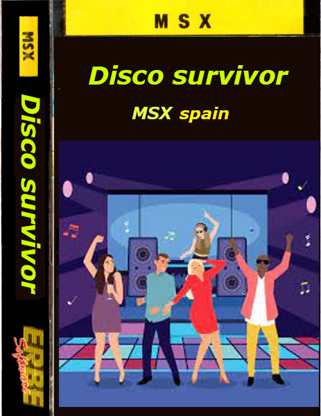

# juegos

1. Hunter

    Plataforma: MSX1

    Language: asm-MPAGD

2. Leo must live

    Plataforma: MSX1

    Language: basic

    

    <a href="https://kikemadrigal.github.io/msx-projects/?disk=leo.dsk&M=MSX2E">Play Leo must live</a>

3. MSX mansion

    Plataforma: MSX1

    Language: basic

    

    <a href="https://kikemadrigal.github.io/msx-projects/?disk=mansion.dsk&M=MSX2E">Play MSX mansion</a>

4. Watchmen

    Plataforma: MSX2

    Language: C

    

    <a href="https://kikemadrigal.github.io//msx-projects/?disk=watchmen.dsk&M=MSX2E">Play Watchmen</a>

5. Disco Survivor

    Plataforma: MSX1

    Language: asm

    

    <a href="https://kikemadrigal.github.io//msx-projects/?cart=disco.romk&M=MSX2E">Play Disco Survivor</a>

6. Tetris

    Platform: MSX2

    Language: C

7. Captain Kirk in space

    Platform: MSX2

    Language: C

8. 3 en raya

    Platform: MSX2

    Language: C

9. Ahorcado

    Platform: MSX2

    Language: C

10. Captain Kirk in Mars (WIP)

    Plaforms: MSX1 y MSX2

    Language: C, asm y basic

11. MSXPolice (WIP)

    Plataforma: MSX1

    Language: asm

12. Amenaza

13. Crazy pong

14. Matamarcianos

15. Friends

16. Starfield

    Plaforms: MSX1 y MS2

    Language: asm y basic

# Utilidades

1. MSX CHECK

    Permite añadir valdaciones en la carga del programa para MSX

