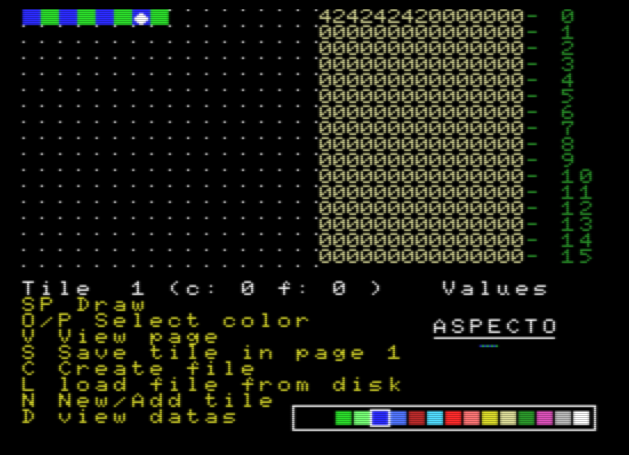
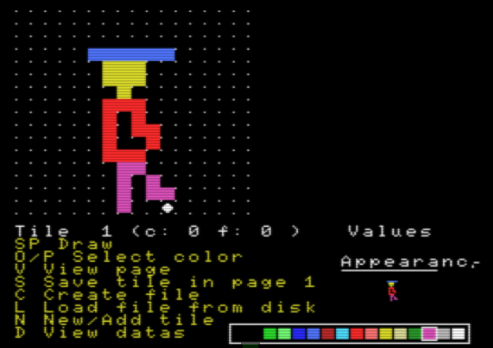
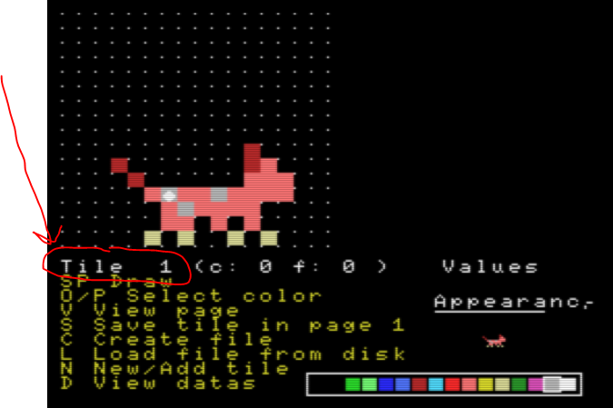
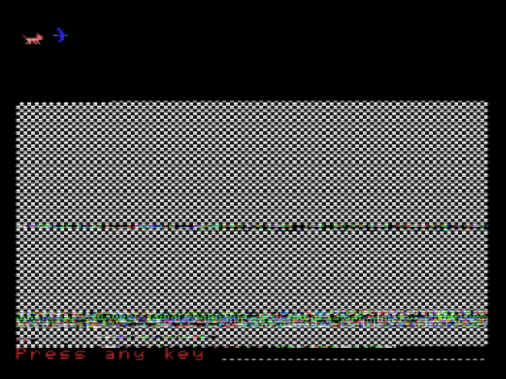
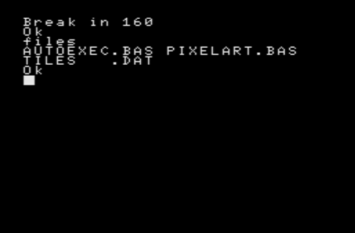

# PIXEL EDITOR

By Juan Morales

2021

MSX 2 Basic

MSX Murcia company

## Play online

https://kikemadrigal.github.io/MSX2-basic-pixel-editor/.?disk=editorv2.dsk

Show how the bytes are stored in the VRAM

Muestra como se guardan los bytes en la VRAM

Press V to see page 1

Presiona V para ver la page 1

Press S to save tile 1

Presiona S para guarar el tile 1

Press N to create a new tile in the next position

Presiona N para crear un nuevo tile en la siguiente posición

Create files from page 1 and your 16x16 pixel tiles, pressing the C key

Crea archivos con la page 1 y tus tiles de 16x16 pixeles, pulsando la tecla C

