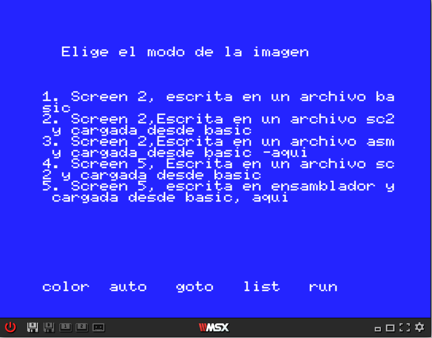
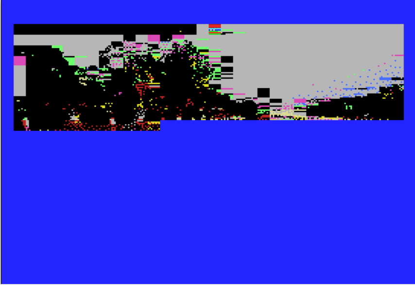

# Enlace para el programa / link to try the program

Programa para demostrar el código que se utiliza en la carga de pantallas sc2, sc5 tanto en ensamblador como en basic.

http://msx.tipolisto.es/webmsx/standalone/?disk=files/testbasic1.dsk

