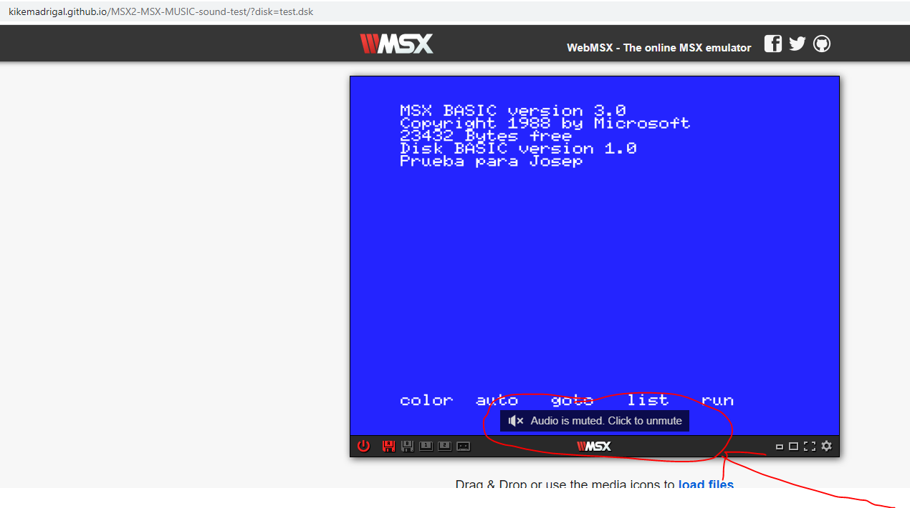
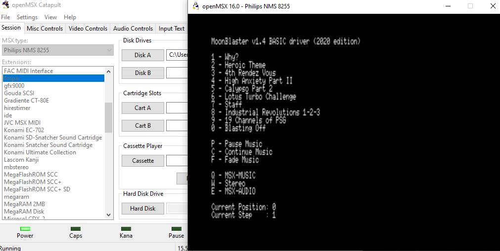
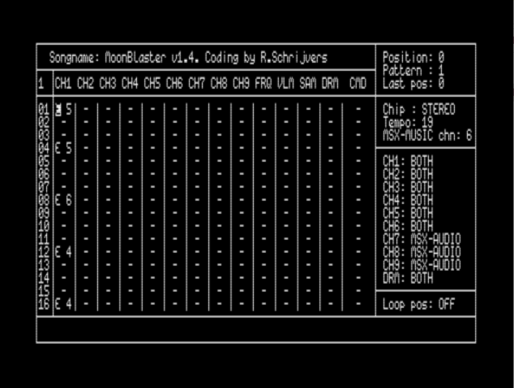
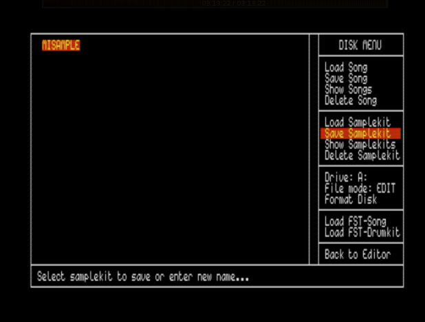

# MML - play test

## Prueba el programa

https://kikemadrigal.github.io/MSX2-MSX-MUSIC-sound-test/?disk=aland.dsk

## Development

Escribe en el cmd de windows make.bat mml

# PT3

## Prueba el programa

https://kikemadrigal.github.io/MSX2-MSX-MUSIC-sound-test/?disk=test.dsk

## Instrucciones 

Después de clonar o descargar el proyecto

En un ventana de comandos de windows escribe make.bat y pulsa intro.

## Development

El archivo main.bas utiliza el archivo music.bin que no utiliza las interrupciones del z80.

El archivo mainint.bas utiliza el archivo musicint.bin que si utiliza las interrupiones del z80.

# MSX MUSIC TEST

Recuerda tener un MSX 2 + FM-PACK o MSX 2+

https://kikemadrigal.github.io/MSX2-MSX-MUSIC-sound-test/?disk=test.dsk

Si lo pruebas en la web recuerda quitar el mute pinchando sobre el mensaje:

Con este test comprobamos como funciona el player Moonblaster o archivo "basic.bin" que está dentro del archivo "BASICDEM.zip" (http://msxbanzai.tni.nl/dev/software.html) que es capaz de reproducir música MSX Music apoyándose del cartucho FM-PACK que contiene el chip ym2413 (https://www.msx.org/wiki/MSX-MUSIC) máxima calidad de sonido en el sistema MSX.

Necesitarás añadir la extensión FMPACK al openMSX sobre un MSX2
   

Un ejemplo más completo es este: https://kikemadrigal.github.io/MSX2-MSX-MUSIC-sound-test/?disk=test2.dsk

## Como crear música MSX MUSIC

Recuerda tener un MSX 2 + FM-PACK o MSX 2+

Puedes descargar el tracker desde aquí: https://github.com/kikemadrigal/MSX2-MSX-MUSIC-sound-test/blob/main/docs/moonblaster-1.4.dsk

Moonblaster 1.4 es un tracker de música para MSX 2 o superior que admite los chips MSX-MUSIC (ym2413) y MSX-AUDIO (y8950).El MSX 2 no incluye esos chips por lo que hay que ponerle un cartucho FM-PACK. Se pueden combinar para crear un efecto estéreo. El player Moonblaster se utilizó en muchos juegos, demos y discos de música creados por la escena MSX.

Pulsa las teclas e y 5, después e y 4, etc, cursores para moverte por los canales o líneas, cuando termines pulsa F1 para reproducir la canción.

Por último pulsa F5 para grabarla dentro del dsk, selecciona Save song:

También necesitarás guardar la muestra de sonido o sample, selecciona Save samplekit:

Puedes encontrar más canciones(*.mbm) con sus muestras de sonido (*.mbk) aquí:https://github.com/kikemadrigal/MSX2-MSX-MUSIC-sound-test/tree/main/docs/Songs

Encuentra mas teclas en el manual:  https://github.com/kikemadrigal/MSX2-MSX-MUSIC-sound-test/blob/main/docs/mbdoc.pdf
