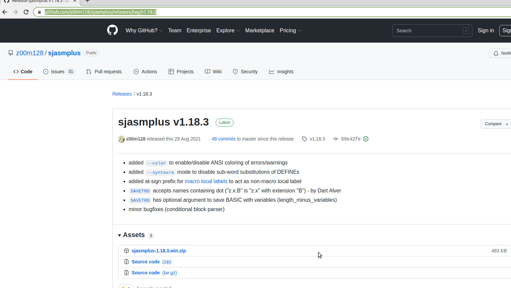
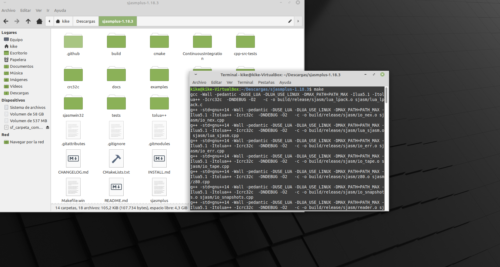
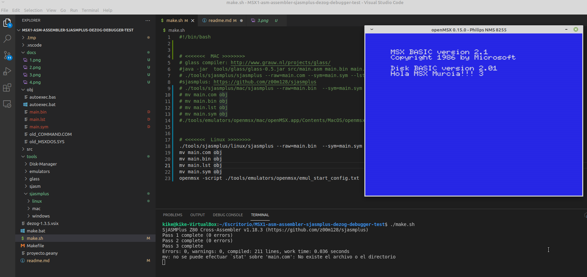

# Depuración z80 con asm

# Enlaces

https://www.youtube.com/watch?v=cf4nPzoosAw&t=802s

https://github.com/S0urceror/DeZog/releases/tag/v1.3.5

# Programas utilizados

## 1.script que ejecuta:

    ### sjasmplus
    Para instalar sjasmplus ve a: https://github.com/z00m128/sjasmplus/releases/tag/v1.18.3
    y pincha en source code (tar.gz)

 

    Te descarás el código fuente que tienes que compilar, recuerda que tienes que tener instalado g++, ahora pone make:

 

    Llévate el binario generado a la carpeta tools/sjasmplus/linux

    ### openmsx
    Si estás en linux puedes instalar openmsx escribiendo en la terminal sudo apt install openmsx, si estás en mac o windows ve a https://openmsx.org/

## 2.dezog

    Es una extendión de visaul studio code

## 3.dezog-1.3.5.vslx

    Descarga (https://github.com/S0urceror/DeZog/releases/tag/v1.3.5) la extensión dezog-1.3.5.vlsx con el comando: code --install-extension dezog-1.3.5.vsix

## 4.Crea el archivo de configuración de depuración o archivo launch.json

    {
        //https://github.com/S0urceror/DeZog/releases
        //code --install-extension dezog-1.3.5.vsix
        //Complemento vscode DeZog
        "version": "0.2.0",
        "configurations": [
            {
                "type": "dezog",
                "request": "launch",
                "name": "Debug OpenMSX",
                "remoteType": "openmsx",
                "listFiles": [
                    {
                        "path": "obj/main.lst",
                        "useFiles": true,
                        //"asm": "tools\\sjasmplus\\windows\\sjasmplus.exe",
                        "asm": "sjasmplus",
                        "mainFile": "src/main.asm",
                        //"pcInSlot": "3 2 3",
                        // Previous Glass release: 
                        // "filter": "/^(?<address>[0-9A-F]{4})\\s(?<bytes>(?:(?:[0-9a-f]{2})\\s|\\s){4})(?<mnemonics>.*)//"
                        
                        // Current Glass release 20-7-2020
                        "filter": "/^(?<address>[0-9A-F]{4})\\s(?<bytes>(?:(?:[0-9a-f]{2})\\s|\\s{2}\\s){4,})\t(?<mnemonics>.*)//"
                    }
                ],
                "startAutomatically": false,
                "commandsAfterLaunch": [
                    "-assert enable" // start with ASSERT mode ON
                ],
                "resetOnLaunch": false,
                "rootFolder": "${workspaceFolder}",
                "tmpDir": ".tmp"
            }
        ]
    }

# Instrucciones

1.type ./make.sh in terminal

Si estás en linux

    Escribe ./make.sh en el terminal

    Es importante que esté openmsx abierto

    

Si estás en mac:

    Descomenta la part de mac que está dentro de make.sh y comenta la de linux

Si estás en windows:

    Escribe make.bat

2.Pincha en depurar.

   
3.Pincha donde quieres poner los breakpoints

4.Muevete entre las líneas de código pinchando en los iconos de la purte superior.

    

